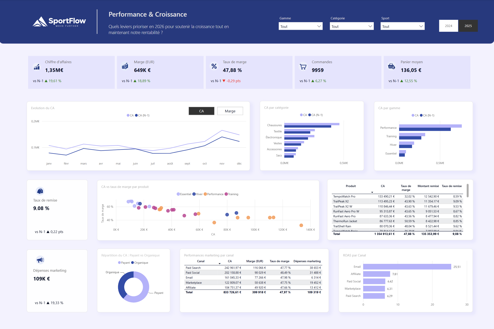

# 📊 SportFlow – Analyse des performances e-commerce

Projet d'analyse de données réalisé avec **Power BI**, à partir des données fictives de SportFlow, une entreprise spécialisée dans le e-commerce sportif.

L'objectif est de construire un dashboard interactif permettant d'analyser les performances commerciales, la rentabilité des produits et l'efficacité des investissements marketing.

> 📅 Analyse réalisée le 18 septembre 2026  
> 📊 Comparaison des performances 2025 vs 2024

---

## 🎯 Objectifs

Cette analyse vise à répondre aux principales questions suivantes :

- Comment évoluent les performances commerciales de SportFlow ?
- Quels produits et catégories contribuent le plus au chiffre d'affaires ?
- Quels produits présentent les meilleurs niveaux de rentabilité ?
- Comment évoluent le chiffre d'affaires et la marge d'une année à l'autre ?
- Quels canaux marketing génèrent le plus de chiffre d'affaires et de marge ?
- Quel est l'impact des remises sur la rentabilité ?

---

## 🗂️ Données

Le projet utilise plusieurs sources de données permettant d'analyser les ventes, les produits, les performances marketing et les objectifs commerciaux.

Les données couvrent notamment :

- Les commandes et ventes
- Les produits, catégories et gammes
- Les performances marketing
- Les dépenses publicitaires
- Les objectifs commerciaux

---

## 🔎 Analyses

### 1. Performance globale
Analyse des principaux indicateurs commerciaux et de leur évolution.

### 2. Évolution des ventes
Analyse de l'évolution du chiffre d'affaires et de la marge.

### 3. Performance des produits et catégories
Analyse de la contribution des produits, catégories et gammes au chiffre d'affaires et à la rentabilité.

### 4. Performance marketing
Analyse du chiffre d'affaires, de la marge et des dépenses marketing et du ROAS par canal.

### 5. Suivi des leviers commerciaux
Analyse du niveau des remises et des indicateurs de rentabilité.

---

## 📊 Dashboard

Le dashboard permet d'explorer les performances commerciales à travers plusieurs axes :

- Performance globale
- Évolution des ventes
- Performance des catégories et gammes
- Performance des produits
- Rentabilité
- Performance marketing
- ROAS
- Suivi des remises

Les différents filtres permettent d'explorer les résultats par année, gamme, catégorie et sport.

---

## 💡 Principaux insights

L'analyse met en évidence une croissance de **19,61 % du chiffre d'affaires en 2025**, accompagnée d'une progression de la marge et d'une légère baisse du taux de marge.

Les principaux moteurs de chiffre d'affaires, notamment la gamme **Performance** et la catégorie **Chaussures**, combinent une forte contribution aux ventes et une croissance soutenue, mais présentent un taux de marge inférieur à la moyenne globale.

À l'inverse, la catégorie **Textile** et la gamme **Training** présentent un profil combinant contribution au chiffre d'affaires et niveau de rentabilité élevé.

L'analyse marketing met en évidence des écarts importants entre les canaux en termes de contribution au chiffre d'affaires et d'efficacité des investissements, avec notamment un **ROAS de 25,51 pour Email**.

Enfin, le taux de remise atteint **9,08 % en 2025**, soit environ **135 K€ de remises**, constituant un point de vigilance dans un contexte de légère baisse du taux de marge.

Les résultats détaillés et les recommandations business sont disponibles dans le fichier [`business_insights.md`](business_insights.md).

---

## 🛠️ Outils & technologies

- Power BI
- Power Query
- DAX

